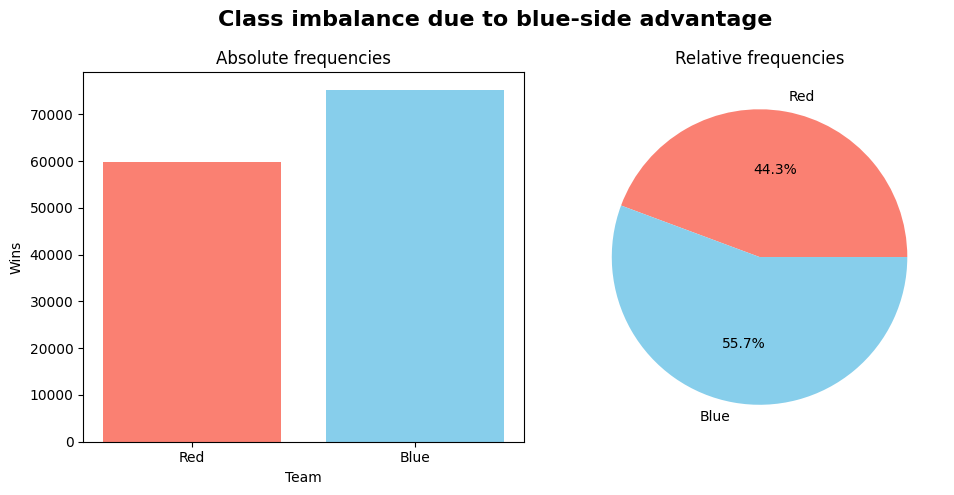

# Dodge Check

## About

Esports analytics is the application of data analysis and statistical methods to competitive video games. One of the problems in this domain is match outcome prediction. This involves using pre-game data to attempt to predict who will win. 

### What is this project? 

Dodge-Check helps you understand your chances of winning a League of Legends match before it even starts, based on which champions both teams picked.

### Why does it matter?

When you're in champion select for a ranked game, it's helpful to know if your team has a strong draft or if you're at a disadvantage. This tool analyzes the team compositions and gives you that insight - something that's actually useful for regular players, not just professionals or analysts.

# Technical Details

## Exploratory Data Analysis

The dataset that I used can be found on [Kaggle](https://www.kaggle.com/datasets/nathansmallcalder/lol-match-history-and-summoner-data-80k-matches). It contains about 148,000 ranked games of League of Legends. 

These are some key findings from the dataset. 

### Class Imbalance

In League of Legends there's something known as *blue-side advantage*. The blue team generally has a 1-3% advantage for various reasons:

- Blue side gets first pick which allows them to secure the strongest meta-defining champions before red side can respond. 
- Blue side has better access to the Rift Herald and Baron Nashor. 
- The game's default camera favours a bottom-left to top-right perspective. It makes it easier for players on the blue side to percieve skill shots because they'll generally be attacked from above.

So we can see that the blue-side advantage in this particular dataset is pretty massive. Despite that, this shouldn't really be an issue for the model. Here's why:

- There are a decent number of examples of both outcomes in the dataset. Class imbalance becomes problematic when there are extreme ratios, like 90-10 or 95-5. At this level it shouldn't affect the model's ability to learn patterns.
- Even if the model becomes slightly biased towards blue side, **that's how it actually is in league**. We wouldn't expect it to be unbiased.