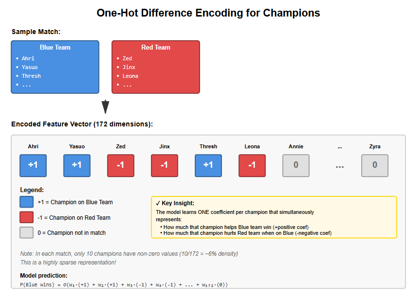
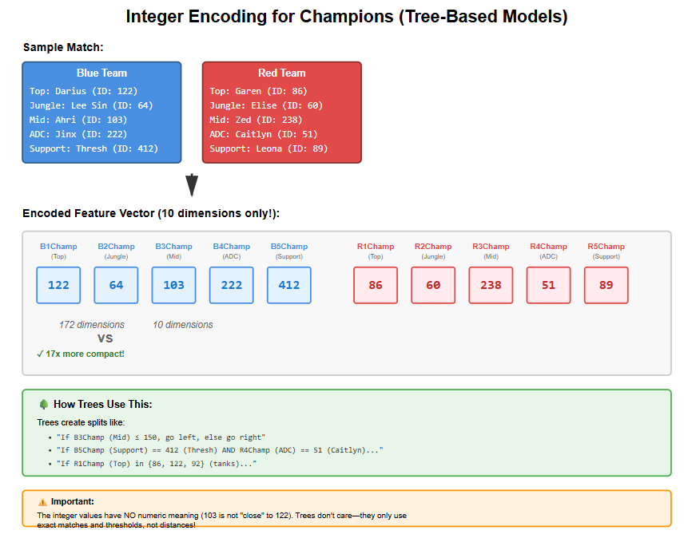
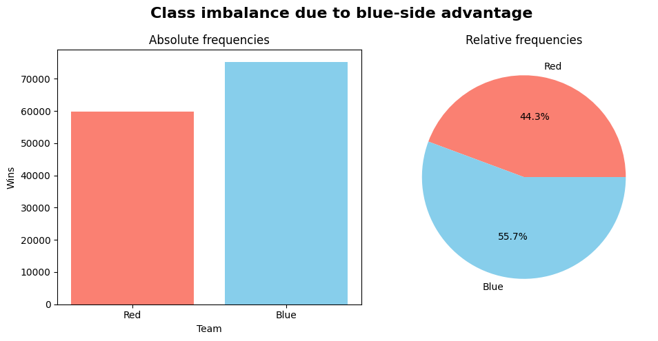
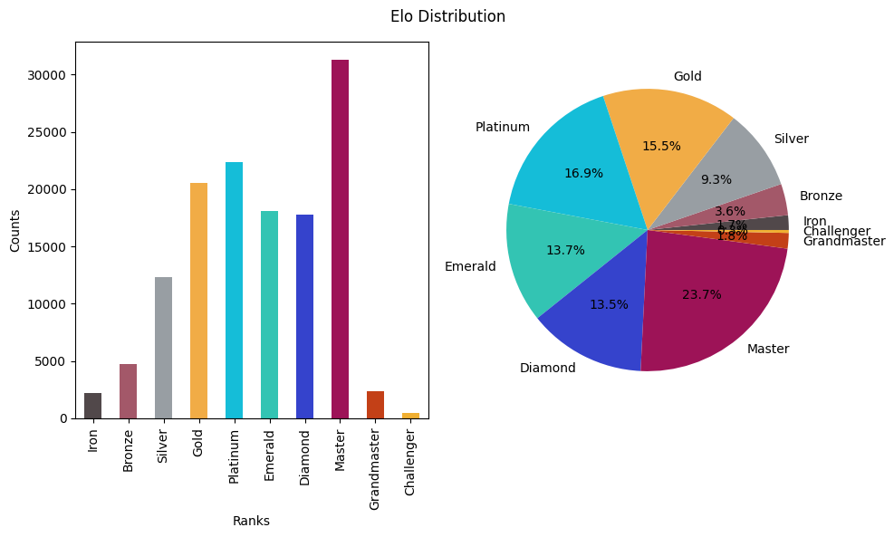
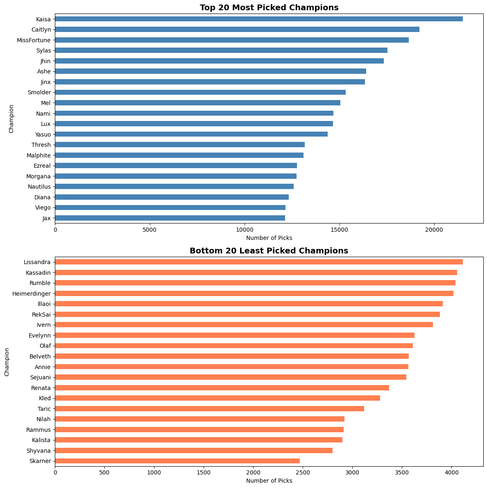
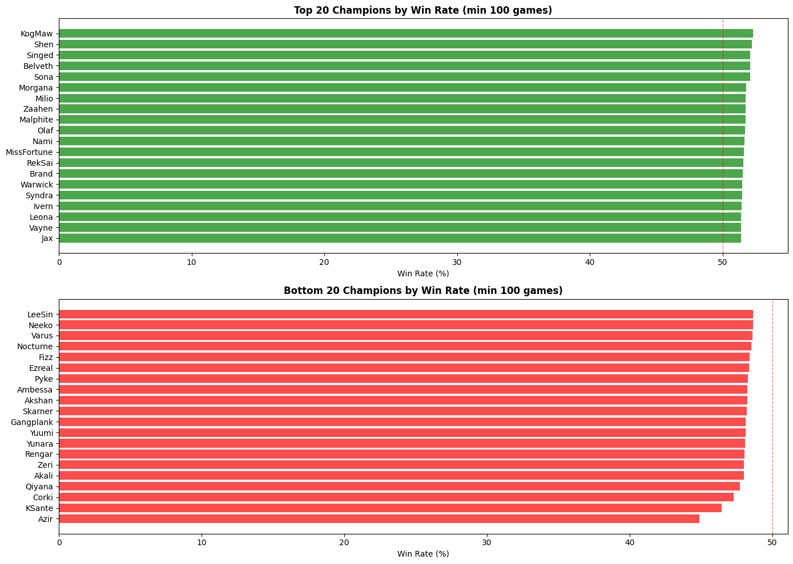
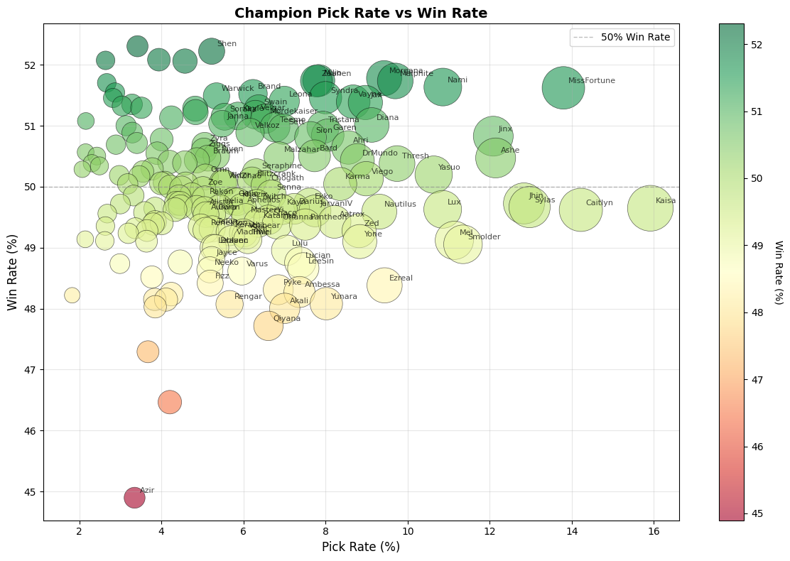

# Dodge Check

## About

Esports analytics is the application of data analysis and statistical methods to competitive video games. One of the problems in this domain is match outcome prediction. This involves using pre-game data to attempt to predict who will win. 

### What is this project? 

Dodge-Check helps you understand your chances of winning a League of Legends match before it even starts, based on which champions both teams picked.

### Why does it matter?

When you're in champion select for a ranked game, it's helpful to know if your team has a strong draft or if you're at a disadvantage. This tool analyzes the team compositions and gives you that insight - something that's actually useful for regular players, not just professionals or analysts.


# Technical Details

## Feature Representation

Machine Learning models require the features to be in some kind of numerical format in order to work. One of the challenges here is finding the best representation for the data that balances memory efficiency, model performance, training speed, and interpretability. 

### One-Hot Encoding with Difference Encoding (Logistic Regression)



For linear models like Logistic Regression, I used one-hot encoding with a symmetrical difference representation:
- Each champion gets one binary column
- Value = +1 if champion is on blue team
- Value = -1 if champion is on red team
- Value = 0 if champion is not in the match

This representation has several advantages:
- **Enforces symmetry**: The model automatically learns that what helps blue team hurts red team
- **Parameter efficient**: 172 features (one per champion) instead of 344 (separate blue/red columns)
- **Better generalization**: Reduces overfitting by constraining the model to respect the game's inherent symmetry
- **More data efficient**: Each training example provides signal about both teams simultaneously


Downsides?

- **High-dimensional sparse matrix**: One-hot encoding on 172 categories creates a sparse matrix, which is memory inefficient. 
- **Cannot capture champion interactions**: Linear models can't capture champion interactions without additional feature engineering. However, encoding pairwise interactions for 172 features would explode the feature space ($172 ^ 2 = 29, 584$).

Technical implementation:
```python
ohe_blue = one_hot_encode(blue_champions)
ohe_red = one_hot_encode(red_champions)
features = ohe_blue - ohe_red  # Difference encoding
```

I'm not expecting Logistic Regression to work that well because it's just incredibly unlikely that champion interactions can be explained fully by linear patterns. Logistic Regression could be improved further through better feature engineering, but I just don't really think it would be worth the effort. 

### Integer Encoding (Tree-Based Models)



For tree-based models (Random Forest, XGBoost, LightGBM), I used direct integer encoding:
- Keep original 10 columns: B1Champ, B2Champ, ..., R1Champ, ..., R5Champ
- Each column contains the champion ID as an integer
- No transformation needed

Why this works for trees:
- **Natural categorical handling**: Trees split on conditions like "champion_id <= 77" without assuming numeric relationships
- **Compact representation**: 10 features instead of 172, leading to faster training
- **No distance assumptions**: Trees don't treat champion 50 as "between" champions 25 and 75
- **Captures positional patterns**: Can learn role-specific strategies (e.g., "if ADC is X and Support is Y")

### Models Compared

- **1. Logistic Regression**
- **2. Random Forest**
- **3. XGBoost**
- **4. LightGBM**

### Training Strategy

- **Data Split**: 60% train, 20% validation, 20% test
- **Validation**: Used validation set to select best hyperparameters for each model
- **Metric**: ROC-AUC score (appropriate for binary classification with slight class imbalance)
- **Final Evaluation**: Best model from each type tested on held-out test set

### Results

The models were evaluated on a test set of 27,037 matches. Here are the final results:

| Model | Validation AUC | Test AUC | Features | Best Hyperparameters |
|-------|----------------|----------|----------|---------------------|
| **Logistic Regression** | 0.5309 | 0.5294 | 172 (one-hot diff) | C=0.01 |
| **Random Forest** | 0.5764 | 0.5815 | 10 (integer) | n_estimators=200, max_depth=20, min_samples_split=10 |
| **XGBoost** | 0.6004 | **0.5993** | 10 (integer) | n_estimators=200, learning_rate=0.3, max_depth=3, subsample=1.0 |
| **LightGBM** | 0.6001 | 0.5948 | 10 (integer) | n_estimators=200, learning_rate=0.1, max_depth=10, num_leaves=31 |

**Key Findings:**

1. **XGBoost achieved the best performance** with a test AUC of 0.5993, slightly edging out LightGBM (0.5948)

2. **Tree-based models significantly outperformed Logistic Regression**:
   - XGBoost: +7.0 percentage points better than Logistic Regression
   - Random Forest: +5.2 percentage points better
   - This confirms that champion synergies involve complex non-linear interactions that linear models cannot capture

3. **Integer encoding was much more efficient** for tree models:
   - 10 features vs 172 features (17x reduction)
   - Faster training times
   - Similar or better performance compared to one-hot encoding

4. **Shallow trees worked best** for gradient boosting:
   - XGBoost optimal depth: 3
   - LightGBM optimal depth: 10 (but with leaf-wise growth)
   - Suggests that draft prediction doesn't require very deep decision boundaries

5. **Model performance ceiling**: The best AUC of ~0.60 indicates that champion draft alone explains only part of match outcomes. Other factors like:
   - Player skill differences
   - In-game execution
   - Team coordination
   - Meta shifts and patches

   These factors likely account for the remaining variance.

### Model Selection

The best performing model (XGBoost with 0.5993 test AUC) is automatically saved to `models/best_tree_model.pkl` along with metadata including:
- Model type and hyperparameters
- Test and validation AUC scores
- Feature names and encoding type
- Ready for deployment without retraining


## Exploratory Data Analysis

The dataset that I used can be found on [Kaggle](https://www.kaggle.com/datasets/nathansmallcalder/lol-match-history-and-summoner-data-80k-matches). It contains about 148,000 ranked games of League of Legends. 

These are some key findings from the dataset. 

### Class Imbalance

In League of Legends there's something known as *blue-side advantage*. The blue team generally has a 1-3% advantage for various reasons:

- Blue side gets first pick which allows them to secure the strongest meta-defining champions before red side can respond. 
- Blue side has better access to the Rift Herald and Baron Nashor. 
- The game's default camera favours a bottom-left to top-right perspective. It makes it easier for players on the blue side to percieve skill shots because they'll generally be attacked from above.




So we can see that the blue-side advantage in this particular dataset is 5 points. Despite that, this shouldn't really be an issue for the model. Here's why:

- There are a decent number of examples of both outcomes in the dataset. Class imbalance becomes problematic when there are extreme ratios, like 90-10 or 95-5. At this level it shouldn't affect the model's ability to learn patterns.
- Even if the model becomes slightly biased towards blue side, **that's how it actually is in league**. We wouldn't expect it to be unbiased.

### Elo Distribution

Master elo is overrepresented in the dataset. If we exclude it, then we get roughly a normal distribution.

- Most games are played in Gold, Platinum, Diamond, and Master elo. The number of games in the first 4 brackets are roughly equal. 
- Master elo has the most amount of games played. Challenger has the fewest.
- Unranked games made up about 15% of the dataset. They were removed from the overall analysis.



### Champion Analysis

The dataset includes all 172 champions in League of Legends, with pick rates ranging from 1.83% to 15.91%. Here are the key insights:

**Pick Rate Distribution:**
- The most popular champions are Kai'Sa (15.91%), Caitlyn (14.22%), Miss Fortune (13.80%), and Sylas (12.97%).
- 12 champions have pick rates above 10%, indicating a clear meta preference.
- The least picked champions include Skarner, Shyvana, Kalista, Rammus, and Nilah.
- All champions see meaningful play (no champion below 1% pick rate).




**Win Rate Analysis:**
- Champion win rates are well-balanced, averaging 49.96% with a median of 49.86%.
- Win rates range from 44.90% (Azir) to 52.30% (Kog'Maw), a relatively narrow spread.
- Top performers include Kog'Maw, Shen, Singed, Bel'Veth, Sona, Morgana, and Malphite.
- Bottom performers include Azir, K'Sante, Corki, Qiyana, Akali, and Zeri.




**Correlation Between Win Rate and Pick Rate:**
- High pick rate does not correlate with high win rate. Kai'Sa, despite being the most picked champion, maintains only a 49.99% win rate.
- Some niche champions like Kog'Maw and Singed show strong win rates despite lower pick rates, suggesting they excel in specific situations.
- The lack of correlation between popularity and performance indicates reasonable champion balance across the roster.



